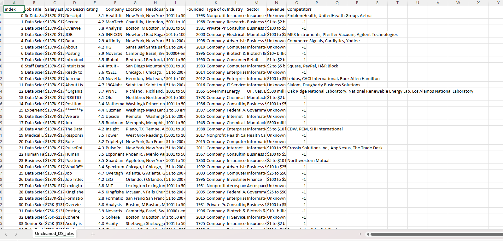

# Data Cleaning and Transformation Report

# 1.Task Description The task involves cleaning and transforming a dataset using Power Query Editor.
- The expected tasks include removing unnecessary characters, splitting columns, creating custom columns, handling missing or negative values, and grouping data.
- The final goal is to reshape the dataset and generate summary tables for salary by role type, company size, and state.

  # 2. Steps Performed in Data Cleaning and Transformation
- Load Dataset: Import CSV file into Power Query Editor.
- Duplicate Data: Create a duplicate query to preserve raw data.
- Salary Estimate Column Cleaning: Extract text before the delimiter (.
- Create Min Sal and Max Sal Columns: Use column from examples to extract minimum and maximum salary.
- Role Type Column: Add a custom column to categorize job titles into predefined groups.
- Location Correction: Create a custom column to standardize location data, then split by delimiter.
- Company Size Columns: Split company size column and remove text Employees.
- Handle Negative Values: Replace -1 with N/A or 0 in relevant columns.
- Clean Company Name: Remove unwanted characters or rates.
- Remove Descriptions: Delete unnecessary description columns.
- Reshape Data – Salary by Role Type: Duplicate query, select relevant columns, convert data types, multiply by 1000, and group by role type to calculate averages.
- Reshape Data – Salary by Role Size: Create reference query, select columns, convert data types, and group by size.
- State Mapping: Merge dataset with state mapping file, replace nulls, and rename columns.
- Reshape Data – Salary by State: Create reference query, select columns, convert data types, and group by state.
- Dependencies View: Check query relationships using Query Dependencies.

# 3. Here's the screenshot of my output before I started data cleaning

# 4. Here's the screenshot of my output after I started data cleaning

