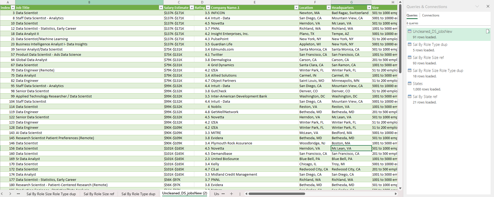
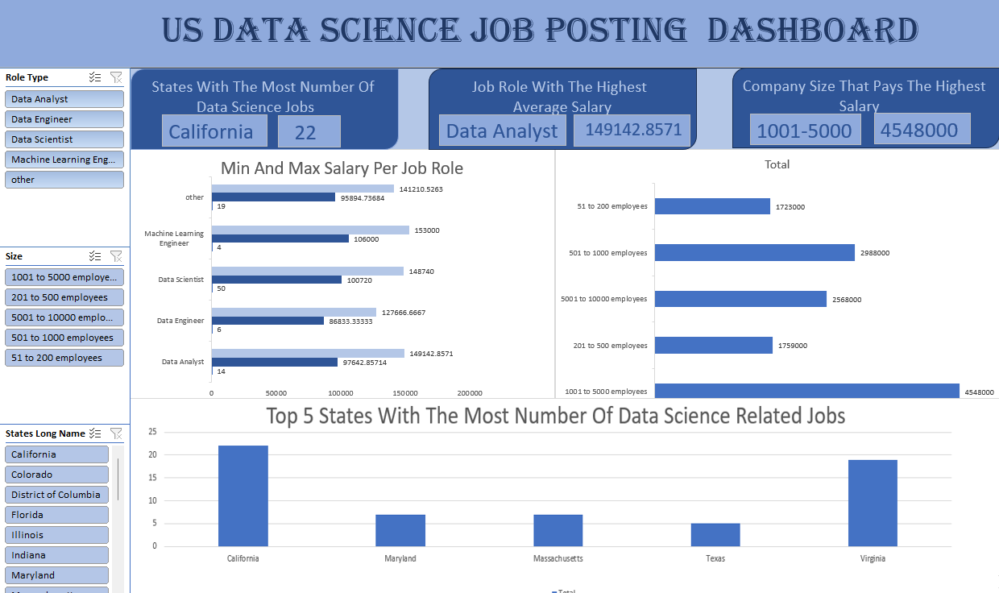

# Midterm Lab Task 3. Using Pivot Table and Create Dashboard

# Step 1: Create Pivot Tables
- You will need three Pivot Tables for different analyses.
- 1. Pivot Table for Salary by Role
- Select your dataset.
- Go to Insert > PivotTable and place it on a new sheet.
- Drag "Job Role" to Rows.
- Drag "Salary" to Values.
- Set it to Average under Value Field Settings.
- Rename the Pivot Table as Sal_By_Role.
# 2. Pivot Table for Number of Data Science Jobs by State
- Select your dataset.
- Insert a new Pivot Table.
- Drag "State" to Rows.
- Drag "Job Count" or any field that counts jobs to Values.-
- Set it to Count under Value Field Settings.
- Rename the Pivot Table as Sal_By_State.
# 3. Pivot Table for Salary by Company Size
- Insert another Pivot Table.
- Drag "Company Size" to Rows.
- Drag "Salary" to Values.
- Set it to Average under Value Field Settings.
- Rename the Pivot Table as Sal_By_Size.
# Step 2: Create Charts
- Use the Pivot Tables to create interactive visualizations.
# 1. Job Role with Highest Average Salary
- Select the Sal_By_Role Pivot Table.
- Go to Insert > Column Chart.
- Format the chart:
- Set a clear title: "Top-Paid Job Roles in Data Science".
- Adjust axis labels for readability.
# 2. State with Most Data Science Jobs
- Select the Sal_By_State Pivot Table.
Insert a Bar Chart.
- Title it "States with the Most Data Science Jobs".
- Sort in descending order.
# 3. Company Size with the Highest Salary
- Select the Sal_By_Size Pivot Table.
- Insert a Pie Chart or Column Chart.
- Title it "Company Size vs. Salary".
# 4. Map (Optional)
- If supported in your Excel version:
- Select the State and Job Count data.
- Insert a Map Chart from the Insert tab.
# Step 3: Insert Slicers for Interactivity
- Select any Pivot Table.
- Go to PivotTable Analyze > Insert Slicer.
- Select Role Type, Company Size, and State.
- Resize and arrange slicers on your dashboard.
# Step 4: Final Touches
- Arrange all charts and slicers neatly.
- Use consistent colors and fonts.
- Add a title like "Data Science Jobs Dashboard".
- Test slicers to ensure they filter charts correctly.

  # 3. Here's the screenshot of my output before I started Creating DashBoard 

# 4. Here's the screenshot of my output after I started Creating DashBoard

